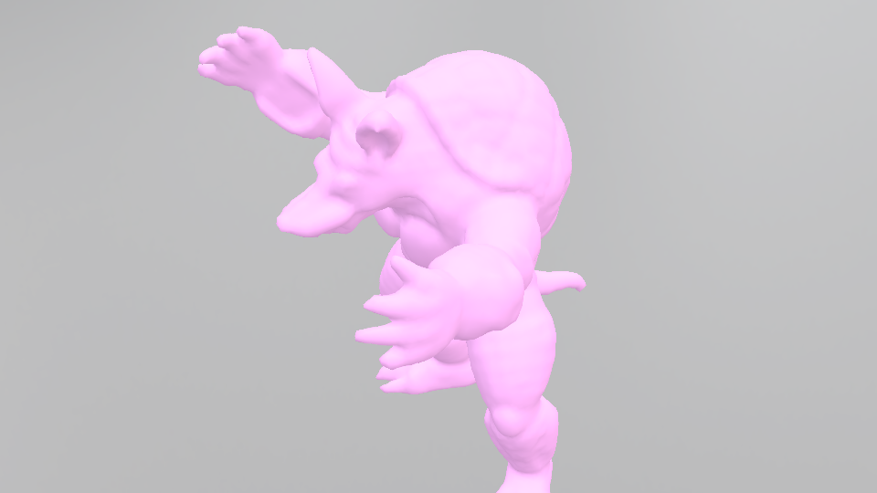

# Nvdiffrast Differentiable Renderer  

My own style Differentiable Renderer based on Nvidffrast framework.  
Reference paper: **Modular Primitives for High-Performance Differentiable Rendering**
Samuli Laine, Janne Hellsten, Tero Karras, Yeongho Seol, Jaakko Lehtinen, Timo Aila
ACM Transactions on Graphics 39(6) (proc. SIGGRAPH Asia 2020)  
For more details, check out the <https://nvlabs.github.io/nvdiffrast/>.

## Installation and Usage

1. Git clone this repository and install all the packages listed in the requirements.txt.  
2. Run below in the terminal and you will see the figure:
```
python render.py
```
 

## Project Structure
1. **geometry_utils.py**: Geometry processing toolbox, which contains various operations on tensorized mesh data for some operations on shapes under differentiable rendering (e.g. laplace-beltrami operator)  
2. **render_utils.py**: Camera system for the renderer, which is consistent to the OpenGL default camera.  
3. **render.py**: Self-written Differentiable rendering system based Nvdiffrast, currently includes global lighting system and direct and normal rendering of meshes.  


## Overview of Nvdiffrast
Nvdiffrast is a PyTorch/TensorFlow library that provides high-performance primitive operations for rasterization-based differentiable rendering. It is a lower-level library compared to previous ones such as redner, SoftRas, or PyTorch3D — nvdiffrast has no built-in camera models, lighting/material models, etc. Instead, the provided operations encapsulate only the most graphics-centric steps in the modern hardware graphics pipeline: **rasterization, interpolation, texturing**, and **antialiasing**. All of these operations (and their gradients) are GPU-accelerated, either via CUDA or via the hardware graphics pipeline.  
Traditional rasterization, a process that converts vector graphics into raster images (pixels), is non-differentiable. This means that traditional graphics pipelines can't be used directly in optimization processes that require gradient information. Nvdiffrast addresses this limitation by making the rasterization process differentiable. This opens up new possibilities for integrating rasterization into neural networks and optimization algorithms.  

## My implementation

1. Self-written simple geometry processing library for differentiable shape manipulation
2. Self-written camera system integrated on Nvdiffrast, and **envmap** <https://graphics.stanford.edu/papers/envmap/> integrated.
3. Flexible and easy to modify differentiable renderer applied to different tasks.


